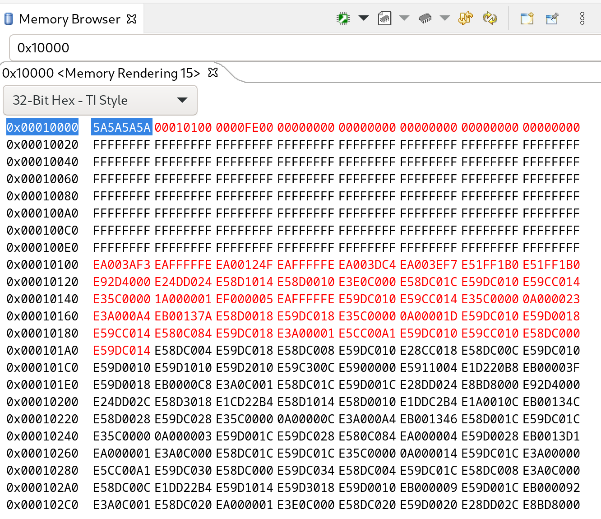

# FlashBootLoaderTI

This repo contains code for **flash loaders** that run on the Texas Instruments (TI)
TMS570 micro controllers. It is based on sample code supplied by TI and described
in the boot loader description found [here](docs/spna192.pdf).

In this context a **flash loader** is the code that runs on the micro controller
while a **host loader** is a program on an external computer, communicating with it
to download new code into flash.

Only the serial version is present here, while TI also provides `spi` and `can bus`
versions.

When built and installed with TI's `Code Composer Studio` on a micro controller
it can be used to load a new application into flash memory over a serial port
using a **host loader** that can use the **ymodem protocol** to send and receive
files.

## Menu

If the the **prompt pin** (GIO-A pin7 on the Dev kit) is set to high and the MCU is
rebooted, a prompt `$ `, will be presented on the the serial port and the flash
loader will wait for a single character command. By responding with `?` the following
menu will be shown

```text
================== Main Menu ==========================
  1. Download Application Image To the Internal Flash
  2. Upload The Application Image From the Internal Flash
  3. Execute The Application Code
  4. Get Flash Loader Version
  5. Get Device Information
  6. Application Status
  ?. Show this menu
=======================================================
```

### Download application image

The first choice will have the flash loader enter ymodem receive mode and wait for
a binary image file to be downloaded by the host. Ymodem will start sending a series of
`C` characters asking for CRC mode checksums on the 1k packets coming from the host. The ymodem protocol has been verified to work correctly with both the common
Unix `sz` programs and a Python version used by the host loader.
The flash loader expects a single file to be sent from the host.

### Upload application image

Choice number 2 will attempt to send the application image from the MCU to the host
computer over the serial port using ymodem. Again this has been tested with the same
programs as the download. A script that uses the `rb` program from the Unix `sz` suite
to receive the application can be as simple as:

```sh
#!/usr/bin/env bash

DEV=/dev/ttyUSB0

stty -F $DEV 115200
rb >$DEV <$DEV
```

The MCU will send the program under the name `UploadedApplicationImage.bin` and it
has been used to verify that the whole ymodem transmission works, by comparing
the uploaded code with the binary file that was transmitted, byte for byte.

### Execute the application

If an application has successfully been downloaded, hitting a `3` will start its
execution. The flash loader checks its memory block for the pattern `5A5A5A5A`,
that is written to flash on the conclusion of a successful download operation.
If the pattern is not found, i.e. because no program has been downloaded, nothing
happens when this option is selected.

### Get flash loader information

Option `4` simply prints out the version of the flash loader:

```text
Flash Loader TI: 1.0.0
```

### Get device information

The output from option `5` looks like:

```text
DEV:           8046AD1D
LOT NUM:       00B6E020
WAFER LOC NUM: 0000502B
FLASH START:   00010000
FLASH END:     00140000
```

The flash start address excludes the flash loader itself.

### Application status

Option `6` shows the following information about the application, if loaded:

```text
Application valid pattern: 5A5A5A5A
Application image size: 0000FE00
Application image address: 00010100
Prompt pin is active
```

Before an application is loaded for the first time (new flash loader) all these
values are `FFFFFFFF`.

The status of the prompt pin can also be seen on this output. The idea is to connect
this GIO input pin to the Vcc pin on the `USB-Serial` adapter from the host computer
and thereby have the flash loader go to prompt mode after the next reboot when
a host is connected regardless of the validity of the stored application.

## Memory structure

The flash loader itself lives at the bottom of the flash memory starting with
`0x20` (8x32 bits) for interrupt vectors followed by the boot loader code. The
application area starts at flash address `0x10000` (64k) with 256 bytes (`0x100`) of
book keeping data followed by the application itself in address `0x10100`. A dump
of application memory is shown below:



If an application has been loaded without an error, the flash loader will write
the pattern `0x5A5A5A5A` at the start of the area, followed by the start address
of the application (`0x10100` here), followed by the size of the application in
bytes. The proper application code starts at address `0x10100` with 32 bytes containing
eight interrupt vectors of the application.

After boot the flash loader is entered, as it occupies the low memory of flash.
In case of a valid pattern found in the application start area, the flash loader
jumps to the application start offset, which in turn shifts all interrupts
to the application handlers. The application will therefore handle all interrupts
until the processor is rebooted and the cycle is repeated.

This in turn means that the application must be set to run in that address.
The linker command file for an application running using the flash loader
could have the `MEMORY` section like:

```text
    VECTORS (X)  : origin=0x00010100 length=0x00000020
    FLASH0  (RX) : origin=0x00010120 length=0x0012FEE0
    STACKS  (RW) : origin=0x08000000 length=0x00001500
    RAM     (RW) : origin=0x08001500 length=0x0002EB00
```

Note that the length of the `FLASH0` has to be shortened by the new offset too.
Also note that this is only done once for a given project and can possibly
be done automatically in the `HalCodeGen` program generator.